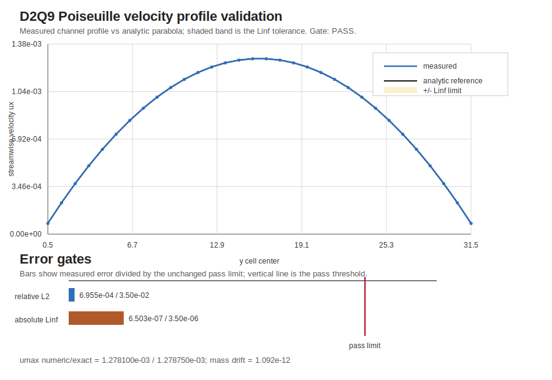

# D2Q9 Poiseuille on FIELD

This example runs a force-driven D2Q9 BGK lattice-Boltzmann channel flow on
FIELD's `UniformMesh`. It is intentionally kept in `examples/`: the D2Q9 stencil,
collision model, forcing, periodic streamwise boundary, and bounce-back walls are
method/physics choices, while FIELD only supplies the structured mesh,
ghost-inclusive indexing, `FieldData` storage, and GRASS scheduling.

The case is plane Poiseuille flow between halfway bounce-back walls. In lattice
units, the kinematic viscosity is

```text
nu = (tau - 1/2) / 3
```

and a constant body force `g = force_x` gives the analytic steady profile

```text
u(y) = g / (2 nu) * y * (H - y),   y = j + 1/2, H = ny.
```

That profile is the validation reference printed in the `RESULT` line. The
`sweep.py` harness runs the configured case and gates the relative L2 and
absolute Linf errors against the analytic parabola.



The profile plot is regenerated by `sweep.py` from the example run output. It
shows the measured velocity profile against the analytic Poiseuille profile, the
absolute Linf tolerance band, and the relative L2 and absolute Linf pass limits.

Reference: S. Chen and G. D. Doolen, "Lattice Boltzmann Method for Fluid Flows",
Annual Review of Fluid Mechanics 30, 329-364 (1998), especially the BGK
viscosity relation `nu = c_s^2 (tau - 1/2)` with `c_s^2 = 1/3`.

Run:

```bash
cargo run --release -p lbm_poiseuille -- examples/lbm_poiseuille/config.toml
python3 examples/lbm_poiseuille/sweep.py
```
